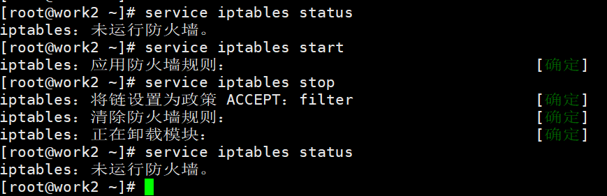

# 关闭防火墙

需首先执行关闭防火墙命令

> 注意：断电后也需确保防火墙处于关闭状态

```bash
# 查看防火墙状态
service iptables status
# 开启防火墙
service iptables start
# 关闭防火墙
service iptables stop
```



Linux CentOS 7可能为以下命令，同样要关闭防火墙。

```bash
#1、启动防火墙
systemctl start firewalld
#2、关闭防火墙
systemctl stop firewalld
#3、重启防火墙
systemctl restart firewalld
#4、查看防火墙状态
systemctl status firewalld
#5、开机禁用防火墙
systemctl disable firewalld
#6、开机启用防火墙
systemctl enable firewalld
#7、查看防火墙开机是否启动
systemctl is-enabled firewalld
#8、查看已启动的服务列表
systemctl list-unit-files|grep enabled
#9、查看启动失败的服务列表
systemctl --failed
```
