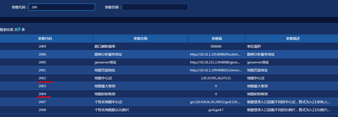
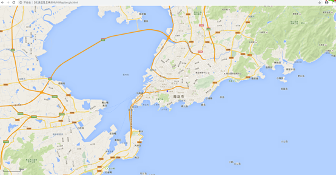

# himap地图服务

## 功能描述

为平台提供地图通用地图接口，发布下载我瓦片及调用geoserver提供的服务展示地图。

## 服务部署

### 准备HiMap.zip工程包

拟将HiMap.zip服务部署在/usr/hileg/deploy/package下，进行解压。

```sh
#进入文件夹
cd /usr/hileg/deploy/package
#解压
unzip HiMap.zip
```

### 修改配置文件

1. 根据现场情况修改/usr/hileg/deploy/package/HiMap/ WEB-INF/classes/himap.properties文件中相关部分，需修改的值为：

   ```properties
   ##瓦片地址均改成一个地址，瓦片获取方法可通过适配器下载获得
   #旧瓦片地址
   TILEDFILEPATH = E:/vector/
   #新版本瓦片地址
   PGISTILEDFILEPATH = E:/vector/
   GOOGLETILEDFILEPATH = E:/vector/
   
   ##数据库相应配置
   #数据库密码
   jdbc.password=hileg12
   #数据库用户名
   jdbc.user=hileg12
   #数据库连接地址
   jdbc.url=jdbc\:oracle\:thin\://@10.16.3.152\:1521/hiatmpdb
   
   ##单点登录相应配置
   #himap系统部署的服务地址，如：http://HIMAP_IP:HIMAP_PORT/HiMap/
   sso.default-target=http://10.16.1.85:804/HiatmpPro/
   #单点登录服务地址，如：http://SSO_IP:SSO_PORT/
   sso.root-url=http://10.16.1.85:801/
   
   ##ZooKeeper相应配置
   #Dubbo ZooKeeper服务器地址，根据现场修改Ip，端口
   remoteservice.dubbo.register.address=10.18.221.134:2181
   #Dubbo ZooKeeper服务器用户名(预留暂不配置)
   remoteservice.dubbo.register.username=
   #Dubbo ZooKeeper服务器密码(预留暂不配置)
   remoteservice.dubbo.register.password=
   #himap系统远程服务提供端口，如按规划为2804（如果为2804则不用修改）。注意，并不要求固定端口，但如果多个子系统安装在同一台服务器中，请保证各子系统此处的端口都不一样，并且不能与系统中其它已经占用的端口冲突，否则系统无法正常启动。
   remoteservice.dubbo.provider.port=2804
   
   ##子系统相应配置
   ##以下为himap依赖子系统服务地址,根据实际部署的子系统，填写相应的属性,属性值如：http://localhost:端口
   #地图服务  http://BSP_IP:BSP_PORT
   module.BSP= http://10.18.221.134:80
   ```


2. 根据现场情况修改/usr/hileg/deploy/package/HiMap/himap.js文件中相关部分，需修改的值为HOSTNAME、DEFAULTMAPTYPE 、DOWNLOADVERSION

   ```javascript
   //当前地图服务访问路径"http://HIMAP_IP:HIMAP_PORT/HiMap/",;
   var HOSTNAME = "http://10.18.221.134:804/HiMap/"
   ```

### 准备tomcat

准备tomcat7以上版本的tomcat，如将apache-tomcat-7.0.59.zip拟拖入/usr/hileg/deploy/tomcat/目录，解压该文件。修改apache-tomcat-7.0.59名称为tomcat7-himap

```sh
# 进入文件夹
cd /usr/hileg/deploy/tomcat/
# 解压
unzip apache-tomcat-7.0.59.zip
# 改名
mv apache-tomcat-7.0.59 tocmat7-himap
```

### 修改tomcat配置文件

打开tocmat7-himap/conf/server.xml按照应用服务器（WEB应用）端口规划的web服务端口、Shutdown端口、AJP端口、redirectPort端口,修改tomcat配置文件。

并根据HiMap工程的实际位置，在该文件的<Host>标签里添加himap相关部署路径。修改完成后如下。（修改下文中↓↓↓+↑↑↑中部分）

```xml
<?xml version="1.0" encoding="UTF-8"?>
<!--↓↓↓↓↓↓↓↓↓↓↓↓↓修改Shutdown:18040↓↓↓↓↓↓↓↓↓↓↓↓↓ -->
<Server port="18040" shutdown="SHUTDOWN">
<!--↑↑↑↑↑↑↑↑↑↑↑↑↑Shutdown↑↑↑↑↑↑↑↑↑↑↑↑↑↑↑↑↑↑↑↑↑↑-->       
    
  <Listener className="org.apache.catalina.startup.VersionLoggerListener" />
  <Listener className="org.apache.catalina.core.AprLifecycleListener" SSLEngine="on" />
  <Listener className="org.apache.catalina.core.JreMemoryLeakPreventionListener" />
  <Listener className="org.apache.catalina.mbeans.GlobalResourcesLifecycleListener" />
  <Listener className="org.apache.catalina.core.ThreadLocalLeakPreventionListener" />

  <GlobalNamingResources>
    <Resource name="UserDatabase" auth="Container"
              type="org.apache.catalina.UserDatabase"
              description="User database that can be updated and saved"
              factory="org.apache.catalina.users.MemoryUserDatabaseFactory"
              pathname="conf/tomcat-users.xml" />
  </GlobalNamingResources>

  <Service name="Catalina">
    <Executor name="tomcatThreadPool" namePrefix="catalina-exec-" 
        maxThreads="1000" minSpareThreads="100" acceptCount="4000"/>
      
  	<!--↓↓↓↓↓↓↓↓↓修改web:812 redirectPort:18122 +并添加 URIEncoding="UTF-8"↓↓↓↓↓↓↓↓↓-->
    <Connector port="804" protocol="HTTP/1.1" 
               connectionTimeout="20000" executor="tomcatThreadPool" 
               redirectPort="18122"  URIEncoding="UTF-8" maxPostSize="0"/>
   <!--↑↑↑↑↑↑↑↑↑↑↑↑↑↑↑↑！web+redirectPort↑↑↑↑↑↑↑↑↑↑↑↑↑↑↑↑↑↑↑↑↑↑↑↑↑↑↑↑↑↑↑↑↑↑↑↑↑↑-->    

    <!-- ↓↓↓↓↓修改AJP:18041+ redirectPort:18042 +并添加   URIEncoding="UTF-8" ↓↓↓↓↓-->
    <Connector port="18041" protocol="AJP/1.3" redirectPort="18042" URIEncoding="UTF-8"/>
    <!--↑↑↑↑↑↑↑↑↑↑↑↑↑↑↑↑！AJP+redirectPort↑↑↑↑↑↑↑↑↑↑↑↑↑↑↑↑↑↑↑↑↑↑↑↑↑↑↑↑↑↑↑↑↑↑↑↑↑↑--> 
      
    <Engine name="Catalina" defaultHost="localhost">
      <Realm className="org.apache.catalina.realm.LockOutRealm">
        <Realm className="org.apache.catalina.realm.UserDatabaseRealm"
               resourceName="UserDatabase"/>
      </Realm>
      <Host name="localhost"  appBase="webapps"
            unpackWARs="true" autoDeploy="true"
			xmlValidation="false" xmlNamespaceAware="false">
        <Valve className="org.apache.catalina.valves.AccessLogValve" directory="logs"
               prefix="localhost_access_log" suffix=".txt"
               pattern="%h %l %u %t &quot;%r&quot; %s %b" />
          
         <!--↓↓↓↓↓    添加HiMap工程包地址指向,注意 path="/HiMap"   ↓↓↓↓↓↓↓↓↓↓↓↓-->
		<Context path="/HiMap" docBase="/usr/hileg/package/HiMap" reloadable="false"></Context>
        <!--↑↑↑↑↑↑↑   添加HiMap工程包地址指向      ↑↑↑↑↑↑↑↑↑↑↑↑↑↓↓↓--> 
      </Host>
    </Engine>
  </Service>
</Server>

```

### 启动

配置完后进入tomcat7-himap/bin目录，执行授权命令并启动。

```shell
# 假设tomcat7-himap在/usr/hileg/deploy/tomcat/tomcat7-himap目录下，cd命令进入
cd /usr/hileg/deploy/tomcat/tomcat7-himap/bin
#授权文件执行权限
chmod 777 *
#启动tocmat
sh startup.sh
```

### 关闭

kill -9 进程号

### 重启

注意：重启时请通过`kill -9 进程号`，来杀死进程。并通过`ps –ef|grep wbc`命令来确认服务是否被彻底关闭。彻底关闭后在通过启动命令启动。​                                                

## 验证访问

打开工作台，在系统参数设置中参数代码搜索200，修改2002、2004修改中心点、初始级别。

 

打开浏览器，输入以下地址进行测试：（ip和端口号根据现场情况进行调整）

[ http://10.16.1.85:804/HiMap/](%20http:/10.16.1.85:804/HiMap/)arcgis.html

 