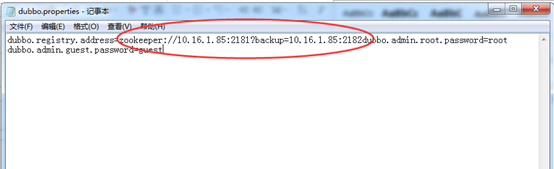

# Dubbo监控服务

## 功能描述

主要提供dubbo运行状态监控展示服务。因为主要为监控使用，所以即使不启动也不影响系统正常运行，启动只是为了监控各服务是否正常。

## 服务部署

1. 解压缩dubbo监控服务压缩包（如tomcat6-dubbomonitor.rar），拟拖入/usr/hileg/deploy/thirdparty下，修改tomcat6-dubbomonitor\ROOT\WEB-INF下的dubbo.properties文件。修改内容：更新确认zookeeper部署服务的地址、端口号。

   ```properties
   #配置服务器的IP+zookeer的端口，因zookeeper默认端口为2181，故只需改服务IP即可。?backup=为备zookeeper,可不进行配置
   dubbo.registry.address=zookeeper://10.18.221.134:2181?backup=192.168.50.56:3182
   ```

      

2. 修改tomcat的相关端口，打开tomcat6-dubbo-admin/conf/server.xml按照应用服务器（WEB应用）端口规划的web服务端口9090、Shutdown端口29090、AJP端口29091、redirectPort端口29092进行端口修改（修改下文中↓↓↓+↑↑↑中部分）。

   ```xml
   <!--↓↓↓↓↓↓↓↓↓Shutdown端口↓↓↓↓↓↓↓↓↓-->
   <Server port="29090" shutdown="SHUTDOWN">
   <!--↑↑↑↑↑↑↑↑↑Shutdown端口↑↑↑↑↑↑↑↑↑-->    
       
     <Listener className="org.apache.catalina.core.JasperListener" />
     <Listener className="org.apache.catalina.mbeans.ServerLifecycleListener" />
     <Listener className="org.apache.catalina.mbeans.GlobalResourcesLifecycleListener" />
     <GlobalNamingResources>
       <Resource name="UserDatabase" auth="Container"
                 type="org.apache.catalina.UserDatabase"
                 description="User database that can be updated and saved"
                 factory="org.apache.catalina.users.MemoryUserDatabaseFactory"
                 pathname="conf/tomcat-users.xml" />
     </GlobalNamingResources>
   
     <Service name="Catalina">
       <!--↓↓↓↓↓↓↓↓↓    web服务端口 + redirectPort     ↓↓↓↓↓↓↓↓↓↓↓↓--> 
       <Connector port="9090" protocol="HTTP/1.1" 
                  connectionTimeout="20000" 
                  redirectPort="29092"  URIEncoding="UTF-8" />
       <!--↑↑↑↑↑↑↑↑↑    web服务端口 + redirectPort     ↑↑↑↑↑↑↑↑↑↑↑↑--> 
         
       <!--↓↓↓↓↓↓↓↓↓      AJP + redirectPort   ↓↓↓↓↓↓↓↓↓-->
       <Connector port="29091" protocol="AJP/1.3" redirectPort="29092" URIEncoding="UTF-8"/>
       <!--↑↑↑↑↑↑↑↑↑      AJP + redirectPort   ↑↑↑↑↑↑↑↑↑↑↑↑--> 
         
       <Engine name="Catalina" defaultHost="localhost">
         <Realm className="org.apache.catalina.realm.UserDatabaseRealm"
                resourceName="UserDatabase"/>
         <Host name="localhost"  appBase="webapps"
               unpackWARs="true" autoDeploy="true"
               xmlValidation="false" xmlNamespaceAware="false">
         </Host>
       </Engine>
     </Service>
   </Server>
   ```

3. 配置完后进入tomcat6-dubbo-admin/bin目录，执行授权命令并启动。

   ```shell
   # 假设tomcat6-dubbo-admin在/usr/hileg/deploy/thirdparty目录下，cd命令进入
   cd /usr/hileg/deploy/thirdparty/tomcat6-dubbo-admin/bin
   #授权文件执行权限
   chmod 777 *
   #启动tocmat
   sh startup.sh
   ```

## 验证

在浏览器地址栏输入http://10.18.221.134:9090/，9090为tomcat对外提供服务的端口号，ip为现场环境IP。

输入用户名root和密码root点击回车。

   

> 注意：重启时请通过`kill -9 进程号`，来杀死进程。并通过`ps –ef|grep tomcat6-dubbo`命令来确认服务是否被彻底关闭。彻底关闭后在通过启动命令启动。

