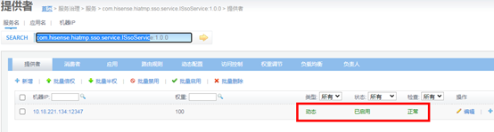

# sso单点登录服务

## 功能描述

为各子系统和平台提供单点登录认证服务。用户登录平台若没有登录则统一跳转此服务的登录页面，同时此服务提供用户所需的必要安装包，可从登录页中软件下载处进行下载。

## 服务部署

### 准备HiATMP-sso工程包

拟将HiATMP-sso.zip服务部署在/usr/hileg/deploy/package下，进行解压。

```sh
#进入文件夹
cd /usr/hileg/deploy/package
#解压
unzip HiATMP-sso.zip
```

### 修改配置文件

根据现场情况修改/usr/hileg/deploy/package/HiATMP-sso/ WEB-INF/classes/sso.properties文件中相关部分，需修改的值为：

```properties
#用户在线超时时间设置（单位：分钟），根据现场修改
userOnlineOvertime=500

##数据库相应配置
#数据库密码
jdbc.password=hileg12
#数据库用户名
jdbc.user=hileg12
#数据库连接地址
jdbc.url=jdbc\:oracle\:thin\://@10.16.3.152\:1521/hiatmpdb

##三平台统一认证,
#统一认证开关，false关闭则不用配置oauth.开头的地址
oauth.active=false
#三平台申请授权接口（三平台地址），http\://三平台IP\:三平台端口/hibis-back/oauth/authorize
oauth.authorize-url=http\://10.16.1.56\:8182/hibis-back/oauth/authorize
#三平台申请令牌接口（三平台地址）http\://三平台IP\:三平台端口/hibis-back/oauth/token
oauth.token-url=http\://10.16.1.56\:8182/hibis-back/oauth/token
#三平台获取当前账号接口（三平台地址）http\://三平台IP\:三平台端口/hibis-back/oauth/getSubCurrentUser
oauth.userinfo-url=http\://10.16.1.56\:8182/hibis-back/oauth/getSubCurrentUser
#管控在三平台的注册ID  （bis_client_register表）
oauth.client-id=HIATMP
#管控在三平台的注册密钥  （bis_client_register表）
oauth.client-secret=5d28b4306d9111ea9e870221860e9b7e
#管控在申请授权成功后的回调接口（SSO地址）http\://SSO_IP\:SSO_PORT/oauthToLogin
oauth.client-tologin=http\://10.18.221.134\:801/oauthToLogin

#单位：分钟，unit:minute
sso.session-timeout=200

##ZooKeeper相应配置
#Dubbo ZooKeeper服务器地址，根据现场修改Ip，端口
remoteservice.dubbo.register.address=10.18.221.134:2181
#Dubbo ZooKeeper服务器用户名(预留暂不配置)
remoteservice.dubbo.register.username=
#Dubbo ZooKeeper服务器密码(预留暂不配置)
remoteservice.dubbo.register.password=
#sso系统远程服务提供端口，如按规划为2801（如果为2801则不用修改）。注意，并不要求固定端口，但如果多个子系统安装在同一台服务器中，请保证各子系统此处的端口都不一样，并且不能与系统中其它已经占用的端口冲突，否则系统无法正常启动。
remoteservice.dubbo.provider.port=2801

##子系统相应配置
##以下为wbc依赖子系统服务地址,根据实际部署的子系统，填写相应的属性,属性值如：http://localhost:端口
#基础服务，http://BSP_IP:BSP_PORT
module.BSP=http://10.18.221.134:80
#地图服务， http://HIMAP_IP: HIMAP_PORT
module.HIMAP=http://10.18.221.134:2181
#工作台服务，http://WBC_IP:WBC_PORT
module.WBC=http://10.18.221.134:812 
#设备运维服务，http://EOMS_IP:EOMS_PORT
module.EOMS=http://10.18.221.134:81 
#此处需填写EOMS的IP和端口 http://EOMS_IP: EOMS_PORT
module.EOMSBASE=http://10.18.221.134:81
#警卫保障系统	HiLEG http://LEG_IP:LEG_PORT
module.LEG=http://10.18.221.134:8002
```

### 准备tomcat

准备tomcat7以上版本的tomcat，如将apache-tomcat-7.0.59.zip拟拖入/usr/hileg/deploy/tomcat/目录，解压该文件。修改apache-tomcat-7.0.59名称为tomcat7-sso

```sh
# 进入文件夹
cd /usr/hileg/deploy/tomcat/
# 解压
unzip apache-tomcat-7.0.59.zip
# 改名
mv apache-tomcat-7.0.59 tocmat7-sso
```

### 修改tomcat配置文件

打开tocmat7-sso/conf/server.xml按照应用服务器（WEB应用）端口规划的web服务端口、Shutdown端口、AJP端口、redirectPort端口,修改tomcat配置文件。

并根据sso工程的实际位置，在该文件的<Host>标签里添加sso相关部署路径。修改完成后如下。（修改下文中↓↓↓+↑↑↑中部分）

```xml
<?xml version="1.0" encoding="UTF-8"?>
<!--↓↓↓↓↓↓↓↓↓↓↓↓↓修改Shutdown:18010↓↓↓↓↓↓↓↓↓↓↓↓↓ -->
<Server port="18010" shutdown="SHUTDOWN">
<!--↑↑↑↑↑↑↑↑↑↑↑↑↑Shutdown↑↑↑↑↑↑↑↑↑↑↑↑↑↑↑↑↑↑↑↑↑↑-->       
    
  <Listener className="org.apache.catalina.startup.VersionLoggerListener" />
  <Listener className="org.apache.catalina.core.AprLifecycleListener" SSLEngine="on" />
  <Listener className="org.apache.catalina.core.JreMemoryLeakPreventionListener" />
  <Listener className="org.apache.catalina.mbeans.GlobalResourcesLifecycleListener" />
  <Listener className="org.apache.catalina.core.ThreadLocalLeakPreventionListener" />

  <GlobalNamingResources>
    <Resource name="UserDatabase" auth="Container"
              type="org.apache.catalina.UserDatabase"
              description="User database that can be updated and saved"
              factory="org.apache.catalina.users.MemoryUserDatabaseFactory"
              pathname="conf/tomcat-users.xml" />
  </GlobalNamingResources>

  <Service name="Catalina">
    <Executor name="tomcatThreadPool" namePrefix="catalina-exec-" 
        maxThreads="1000" minSpareThreads="100" acceptCount="4000"/>
      
  	<!--↓↓↓↓↓↓↓↓↓修改web:801 redirectPort:18012 +并添加 URIEncoding="UTF-8"↓↓↓↓↓↓↓↓↓-->
    <Connector port="801" protocol="HTTP/1.1" 
               connectionTimeout="20000" executor="tomcatThreadPool" 
               redirectPort="18012"  URIEncoding="UTF-8" maxPostSize="0"/>
   <!--↑↑↑↑↑↑↑↑↑↑↑↑↑↑↑↑！web+redirectPort↑↑↑↑↑↑↑↑↑↑↑↑↑↑↑↑↑↑↑↑↑↑↑↑↑↑↑↑↑↑↑↑↑↑↑↑↑↑-->    

    <!-- ↓↓↓↓↓修改AJP:18011+ redirectPort:18012 +并添加   URIEncoding="UTF-8" ↓↓↓↓↓-->
    <Connector port="18011" protocol="AJP/1.3" redirectPort="18012" URIEncoding="UTF-8"/>
    <!--↑↑↑↑↑↑↑↑↑↑↑↑↑↑↑↑！AJP+redirectPort↑↑↑↑↑↑↑↑↑↑↑↑↑↑↑↑↑↑↑↑↑↑↑↑↑↑↑↑↑↑↑↑↑↑↑↑↑↑--> 
      
    <Engine name="Catalina" defaultHost="localhost">
      <Realm className="org.apache.catalina.realm.LockOutRealm">
        <Realm className="org.apache.catalina.realm.UserDatabaseRealm"
               resourceName="UserDatabase"/>
      </Realm>
      <Host name="localhost"  appBase="webapps"
            unpackWARs="true" autoDeploy="true"
			xmlValidation="false" xmlNamespaceAware="false">
        <Valve className="org.apache.catalina.valves.AccessLogValve" directory="logs"
               prefix="localhost_access_log" suffix=".txt"
               pattern="%h %l %u %t &quot;%r&quot; %s %b" />
          
         <!--↓↓↓↓↓    添加HiATMP-sso工程包地址指向,注意 path="/"   ↓↓↓↓↓↓↓↓↓↓↓↓-->
		<Context path="/" docBase="/usr/hileg/package/HiATMP-sso" reloadable="false"></Context>
        <!--↑↑↑↑↑↑↑   添加HiATMP-sso工程包地址指向      ↑↑↑↑↑↑↑↑↑↑↑↑↑↓↓↓--> 
      </Host>
    </Engine>
  </Service>
</Server>

```

### 个性化配置

sso个性化配置，一般为关闭状态。可修改HiATMP-sso/config/downloadList.json，配置新版权信息展示与使用手册下载功能。

```javascript
copyright:’0’//1开启版权信息展示，0关闭
readmeshow:’0’//1开启使用手册下载功能，0关闭
```

### 启动

配置完后进入tomcat7-sso/bin目录，执行授权命令并启动。

```shell
# 假设tomcat7-sso在/usr/hileg/deploy/tomcat/tomcat7-sso目录下，cd命令进入
cd /usr/hileg/deploy/tomcat/tomcat7-sso/bin
#授权文件执行权限
chmod 777 *
#启动tocmat
sh startup.sh
```

### 关闭

kill -9 进程号

### 重启

注意：重启时请通过`kill -9 进程号`，来杀死进程。并通过`ps –ef|grep sso`命令来确认服务是否被彻底关闭。彻底关闭后在通过启动命令启动。

## 验证

进入dubbo监控页面选择服务

   

​    在SEARCH栏中输入com.hisense.hiatmp.sso.service.ISsoService搜索，搜索到的服务正常则说明部署成功。

   

