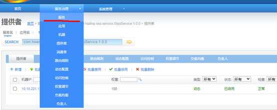

#  bsp基础管理服务

## 功能描述

主要包括平台的基础管理服务和为各子系统提供基础信息服务。包括警员管理、部门管理、账号管理等。

## 服务部署

### 准备HiATMP-BSP工程包

拟将HiATMP-BSP.zip服务部署在/usr/hileg/deploy/package下，进行解压。

```sh
#进入文件夹
cd /usr/hileg/deploy/package
#解压
unzip HiATMP-BSP.zip
```

### 修改配置文件

根据现场情况修改/usr/hileg/deploy/package/HiATMP-BSP/ WEB-INF/classes/bsp.properties文件中相关部分，需修改的值为：

```properties
##数据库相应配置
#数据库密码
jdbc.password=hileg12
#数据库用户名
jdbc.user=hileg12
#数据库连接地址
jdbc.url=jdbc\:oracle\:thin\://@10.16.3.152\:1521/hiatmpdb

##单点登录相应配置
#bsp系统部署的服务地址，如：http://BSP_IP:BSP_PORT/HiatmpPro/
sso.default-target=http://10.18.221.134:80/HiatmpPro/
#单点登录服务地址，如：http://SSO_IP:SSO_PORT/
sso.root-url=http://10.18.221.134:801/

##ZooKeeper相应配置
#Dubbo ZooKeeper服务器地址，根据现场修改Ip，端口
remoteservice.dubbo.register.address=10.18.221.134:2181
#Dubbo ZooKeeper服务器用户名(预留暂不配置)
remoteservice.dubbo.register.username=
#Dubbo ZooKeeper服务器密码(预留暂不配置)
remoteservice.dubbo.register.password=
#bsp系统远程服务提供端口，如按规划为280（如果为280则不用修改）。注意，并不要求固定端口，但如果多个子系统安装在同一台服务器中，请保证各子系统此处的端口都不一样，并且不能与系统中其它已经占用的端口冲突，否则系统无法正常启动。
remoteservice.dubbo.provider.port=280

##子系统相应配置
##以下为bsp依赖子系统服务地址,根据实际部署的子系统，填写相应的属性,属性值如：http://localhost:端口

#基础服务，http://BSP_IP:BSP_PORT
module.BSP=http://10.18.221.134:80
#地图服务， http://HIMAP_IP: HIMAP_PORT
module.HIMAP=http://10.18.221.134:2181
#工作台服务，http://WBC_IP:WBC_PORT
module.WBC=http://10.18.221.134:812 
#设备运维服务，http://EOMS_IP:EOMS_PORT
module.EOMS=http://10.18.221.134:81 
#此处需填写EOMS的IP和端口 http://EOMS_IP: EOMS_PORT
module.EOMSBASE=http://10.18.221.134:81 
#警卫保障系统	HiLEG http://LEG_IP:LEG_PORT
module.LEG=http://10.18.221.134:8002 
   
```

管控工作台跳转配置：/usr/hileg/deploy/package/HiATMP-BSP/home/bsp/js/url_conf.js

```javascript
//工作台IP:端口地址   
var workbenchip = 'http://10.18.221.134:812';
```

安保页面工作台跳转地址：/usr/hileg/deploy/package/HiATMP-BSP /home/hileg/config.js

```javascript
//工作台IP:端口地址  
var workbenchip = "http://10.18.221.134:812";  
```

### 准备tomcat

准备tomcat7以上版本的tomcat，如将apache-tomcat-7.0.59.zip拟拖入/usr/hileg/deploy/tomcat/目录，解压该文件。修改apache-tomcat-7.0.59名称为tomcat7-bsp

```sh
# 进入文件夹
cd /usr/hileg/deploy/tomcat/
# 解压
unzip apache-tomcat-7.0.59.zip
# 改名
mv apache-tomcat-7.0.59 tocmat7-bsp
```

### 修改tomcat配置文件

打开tocmat7-bsp/conf/server.xml按照应用服务器（WEB应用）端口规划的web服务端口、Shutdown端口、AJP端口、redirectPort端口,修改tomcat配置文件。

并根据bsp工程的实际位置，在该文件的<Host>标签里添加bsp相关部署路径。修改完成后如下。（修改下文中↓↓↓+↑↑↑中部分）

```xml
<?xml version="1.0" encoding="UTF-8"?>
<!--↓↓↓↓↓↓↓↓↓↓↓↓↓修改Shutdown:18000↓↓↓↓↓↓↓↓↓↓↓↓↓ -->
<Server port="18000" shutdown="SHUTDOWN">
<!--↑↑↑↑↑↑↑↑↑↑↑↑↑Shutdown↑↑↑↑↑↑↑↑↑↑↑↑↑↑↑↑↑↑↑↑↑↑-->       
    
  <Listener className="org.apache.catalina.startup.VersionLoggerListener" />
  <Listener className="org.apache.catalina.core.AprLifecycleListener" SSLEngine="on" />
  <Listener className="org.apache.catalina.core.JreMemoryLeakPreventionListener" />
  <Listener className="org.apache.catalina.mbeans.GlobalResourcesLifecycleListener" />
  <Listener className="org.apache.catalina.core.ThreadLocalLeakPreventionListener" />

  <GlobalNamingResources>
    <Resource name="UserDatabase" auth="Container"
              type="org.apache.catalina.UserDatabase"
              description="User database that can be updated and saved"
              factory="org.apache.catalina.users.MemoryUserDatabaseFactory"
              pathname="conf/tomcat-users.xml" />
  </GlobalNamingResources>

  <Service name="Catalina">
    <Executor name="tomcatThreadPool" namePrefix="catalina-exec-" 
        maxThreads="1000" minSpareThreads="100" acceptCount="4000"/>
      
  	<!--↓↓↓↓↓↓↓↓↓修改web:80 redirectPort:18002 +并添加 URIEncoding="UTF-8"↓↓↓↓↓↓↓↓↓-->
    <Connector port="80" protocol="HTTP/1.1" 
               connectionTimeout="20000" executor="tomcatThreadPool" 
               redirectPort="18002"  URIEncoding="UTF-8" maxPostSize="0"/>
   <!--↑↑↑↑↑↑↑↑↑↑↑↑↑↑↑↑！web+redirectPort↑↑↑↑↑↑↑↑↑↑↑↑↑↑↑↑↑↑↑↑↑↑↑↑↑↑↑↑↑↑↑↑↑↑↑↑↑↑-->    

    <!-- ↓↓↓↓↓修改AJP:18001+ redirectPort:18002 +并添加   URIEncoding="UTF-8" ↓↓↓↓↓-->
    <Connector port="18001" protocol="AJP/1.3" redirectPort="18002" URIEncoding="UTF-8"/>
    <!--↑↑↑↑↑↑↑↑↑↑↑↑↑↑↑↑！AJP+redirectPort↑↑↑↑↑↑↑↑↑↑↑↑↑↑↑↑↑↑↑↑↑↑↑↑↑↑↑↑↑↑↑↑↑↑↑↑↑↑--> 
      
    <Engine name="Catalina" defaultHost="localhost">
      <Realm className="org.apache.catalina.realm.LockOutRealm">
        <Realm className="org.apache.catalina.realm.UserDatabaseRealm"
               resourceName="UserDatabase"/>
      </Realm>
      <Host name="localhost"  appBase="webapps"
            unpackWARs="true" autoDeploy="true"
			xmlValidation="false" xmlNamespaceAware="false">
        <Valve className="org.apache.catalina.valves.AccessLogValve" directory="logs"
               prefix="localhost_access_log" suffix=".txt"
               pattern="%h %l %u %t &quot;%r&quot; %s %b" />
          
         <!--↓↓↓↓↓    添加HiATMP-BSP工程包地址指向,注意 path="/HiatmpPro"   ↓↓↓↓↓↓↓↓↓↓↓↓-->
		<Context path="/HiatmpPro" docBase="/usr/hileg/package/HiATMP-BSP" reloadable="false"></Context>
        <!--↑↑↑↑↑↑↑   添加HiATMP-BSP工程包地址指向      ↑↑↑↑↑↑↑↑↑↑↑↑↑↓↓↓--> 
      </Host>
    </Engine>
  </Service>
</Server>

```

### 启动

配置完后进入tomcat7-bsp/bin目录，执行授权命令并启动。

```shell
# 假设tomcat7-bsp在/usr/hileg/deploy/tomcat/tomcat7-bsp目录下，cd命令进入
cd /usr/hileg/deploy/tomcat/tomcat7-bsp/bin
#授权文件执行权限
chmod 777 *
#启动tocmat
sh startup.sh
```

### 关闭

kill -9 进程号

### 重启

注意：重启时请通过`kill -9 进程号`，来杀死进程。并通过`ps –ef|grep bsp`命令来确认服务是否被彻底关闭。彻底关闭后在通过启动命令启动。

## 验证

在浏览器中输入http://BSP_IP:BSP_PORT/HiatmpPro/home/hileg跳转登录页面，输入完默认超级管理员初始账号密码，admin/admin123，则进行跳转入安保BSP页面

  

也可以从dubbo监控页面查看是否程序启动成功，进入dubbo监控页面选择服务，

   

在SEARCH栏中输入com.hisense.hiatmp.bsp.auth.service.IAuthService搜索，搜索到的服务正常则说明部署成功。

  