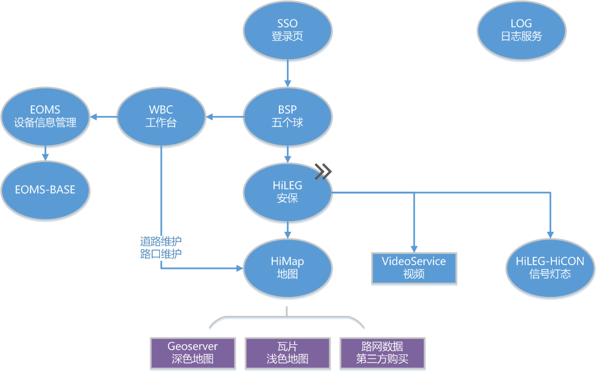

## 安保平台服务之间关系

输入平台地址后，首先跳转**登录页**（`HiATMP-sso`）

登录后进入五个球的**菜单页面**（`HiATMP-BSP`）

- 左上角可进入**工作台**（`HiATMP-wbc`）
  - 工作台可进行**设备运维**（`HiATMP-eoms`,`HiATMP-eomsbase`）
  - **道路路口维护**（`HiMap`）

    - 地图服务通过`Geoserver` 发布第三方路网数据，展示深色地图

      >部署见**应用服务器(WEB应用)**章节Geoserver

    - 通过瓦片展示浅色地图。
- 通过菜单可进入**安保页面**（`HiATMP-LEG`）
  - 依赖`VideoService`看**视频**

    > 部署见**应用服务器(WEB应用)**章节VideoService

  - 依赖`HiLEG-HiCON`获取信号灯态，驻留**信号机**

    > 部署见**其他服务**章节hileg-hicon

以上服务均通过**日志服务**记录日志(`HiATMP-LOG`)

