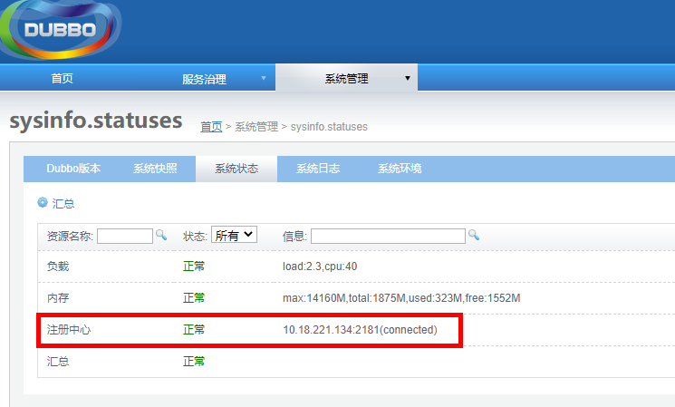

# 安装zookeeper

Zookeer主要为各子系统和平台运行提供一致性协调服务。系统间的后台间接口的调用使用的就是zookeeper。解压缩zookeeper服务器压缩包（如zookeeper-3.4.6.tar.gz）到相应安装目录。

## 修改配置文件

修改zookeeper-3.4.6/conf/zoo.cfg文件

```properties
#数据目录，如：/usr/zookeeper
dataDir=/usr/zookeeper
#连接端口如:2181,为后期各package配置使用
clientPort=2181
```

## 启动zookeeper

在zookeeper目录下，执行以下命令

```bash
sh bin/zkServer.sh start
```

## 验证

可在dubbo启动后，查看zookeeper的启动状态。如下图

