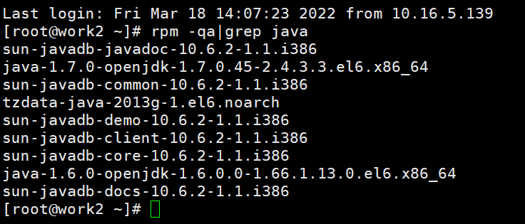
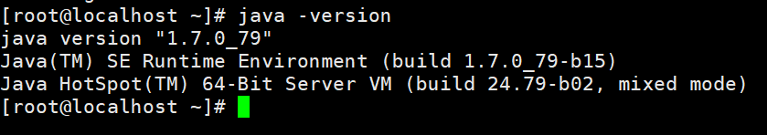

# jdk安装

平台各个应用服务以及适配器要求的jdk版本不尽相同，但安装方法类似，应用服务器1(WEB服务)中需要jdk版本为1.7，故需要安装jdk1.7版本jdk。

下面以1.7jdk为例，将jdk安装文件拷贝至主备在服务器上，jdk的安装很简单，重点在配置环境变量上，下面以jdk1.7.0_45版本为示例：

## 卸载原有无用jdk

> 注意：若还出现类似以下界面，则需要先卸载自带的jdk版本。（不能使用openjdk）

   先查看jdk，命令为：

```bash
 rpm -qa|grep java
```

 

然后输入如下命令进行卸载（`--nodeps`后面的java信息由系统自带的具体版本确定）：

```bash
rpm -e --nodeps java-1.7.0-openjdk-1.7.0.45-2.4.3.3.el6.x86_64
```


## jdk安装步骤

1. 将下载的jdk安装文件jdk-7u79-linux-x64.rpm拷贝到/usr/java里，并将其解压，命令为：rpm -ivh jdk-7u79-linux-x64.rpm

2. 在/etc/profile里面增加环境变量：

   ```shell
   export JAVA_HOME=/usr/java/jdk1.7.0_79
   export JAVA_BIN=/usr/java/jdk1.7.0_79/bin
   export PATH=$PATH:$JAVA_HOME/bin:$JAVA_HOME/jre/bin
   export CLASSPATH=.:$JAVA_HOME/lib/dt.jar:$JAVA_HOME/lib/tools.jar
   export JAVA_HOME JAVA_BIN PATH CLASSPATH
   ```

   > 注意，linux中环境变量是以":"分割的，不是";"，目录要设置正确，特别注意不要有空格等

3. 使用./etc/profile或 source /etc/profile使修改生效；、

4. 查看jdk是否安装好：Java  –version，显示类似如下信息说明安装配置正确。


